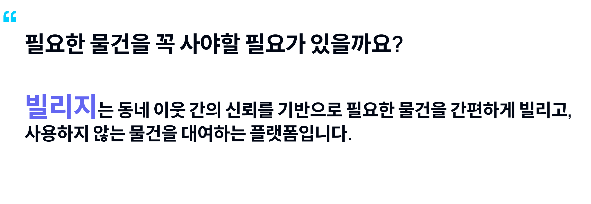
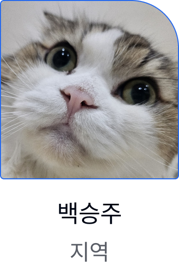
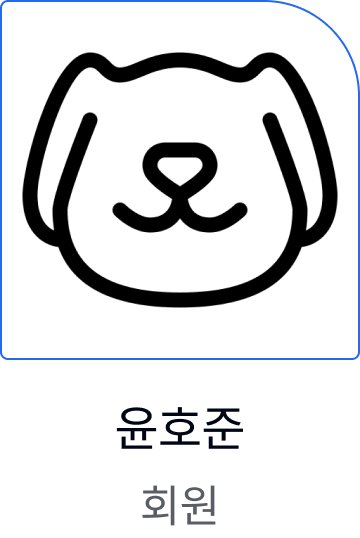
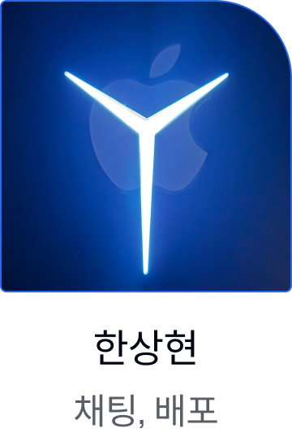
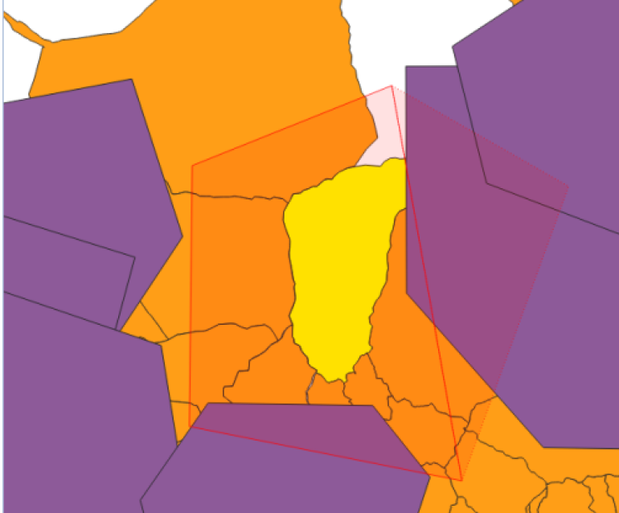
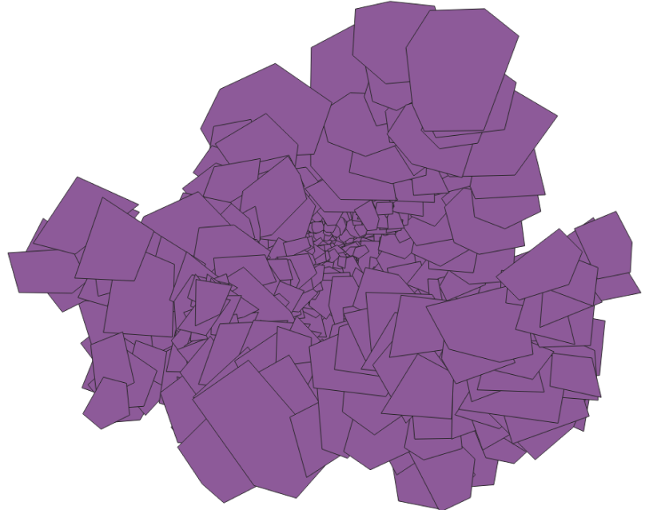

# Team Billage - Backend

<div align=center></div>
<br/><br/><br/>

<div align=center><h1>프로젝트 소개</h1></div>

<div align=center></div>
<br/><br/><br/>

<div align=center><h2>팀원</h2></div>

  <div align=center styles="display:flex; justify-content: space-between">
    
    
    
  </div>
  <div align=center styles="display:flex; justify-content: space-between">
    
    
  </div>

<br/><br/><br/>

<div align=center><h2>📚 STACKS</h2></div>

- JAVA 17
- SpringBoot
- Redis
- STOMP
- QueryDSL
- Nginx
- Amazon SDK
  - S3 Bucket
  - RDS
- QGIS
  <br/><br/><br/>

<div align=center><h2>구현 기능</h2></div>

<div>
  <div align=center>
    <h3>위치 필터링</h3>
  </div>
  <div align=center>
    <h4>사용자의 현재 위치를 바탕으로 상품을 필터링하여 보여줍니다.</h4>
    <h4>이를 통해 사용자의 주변 지역 상품만을 확인할 수 있게 합니다.</h4>
  </div>
  <div align=center styles="display:flex; justify-content: space-between">
    
    
  </div>
  <br/><br/><br/>
</div>

<div align=center>
  <h3>실시간 채팅</h3>
</div>
<div align=center>
  <h4>판매자와 구매자 간 실시간 채팅으로 가격 합의점을 볼 수 있도록 하였습니다.</h4>
</div>

<br/><br/><br/>

<div align=center>
  <h1>시작 가이드</h1>
</div>

<div align=center>
  <h2>Requirements</h2>
  <h4>JAVA 17 SDK</h4>
</div>
<br/><br/>
<div align=center>
  <h2>Enviromnents</h2>
</div>

```
JWT_SECRET_KEY={{YOUR_CUSTOM_JWT_SECRET_KEY}}
ACCESS_TOKEN_DURATION={{DURATION_MIN}}
REFRESH_TOKEN_DURATION={{DURATION_DATE}}

AFTER_OAUTH_REDIRECT_URL={{YOUR_FRONTEND_MAIN_URL}}

ALLOWED_ORIGIN_URL={{YOUR_FRONTEND_URL}}

CATEGORY_IMAGE_BASEURL=http://localhost:8080

DB_URL=jdbc:mysql://{{YOUR_DATABASE_PATH}}
DB_USERNAME={{DATABASE_USER_NAME}}
DB_PASSWORD={{DATABASE_USER_PW}}

GOOGLE_CLIENT_ID={{GOOGLE_GCP_CLIENT_ID}}
GOOGLE_CLIENT_SECRET={{GOOGLE_GCP_CLIENT_PW}}

REDIS_REMOTE_HOST={{ENTER_YOUR_REDIS_HOST_URL : HOST ? localhost}}
REDIS_REMOTE_PORT={{ENTER_YOUR_REDIS_HOST_PORT : PORT ? 6379}}
REDIS_REMOTE_USERNAME={{YOUR_REDIS_POST_USERNAME ? USERNAME : none...}}
REDIS_REMOTE_PASSWORD={{YOUR_REDIS_POST_PASSWORD ? PASSWORD : none...}}
REDIS_TOKEN_TTL={{REFRESH_TOKEN_TTL_MIN}}

S3_ACCESS_KEY={{S3_ACCESS_KEY}}
S3_SECRET_KEY={{S3_ACCESS_SECRET_KEY}}

BASE_URL=http://localhost:8080

NAVER_MAIL={{YOUR_NAVER_MAIL_SMTP_ACCOUNT}}
NAVER_MAIL_PASSWORD={{YOUR_NAVER_MAIL_SMTP_PW}}
NAVER_CLIENT_ID={{NAVER_MAP_CLIENT_ID}}
NAVER_CLIENT_SECRET={{NAVER_MAP_CLIENT_SECRET}}
```

<br/><br/>
